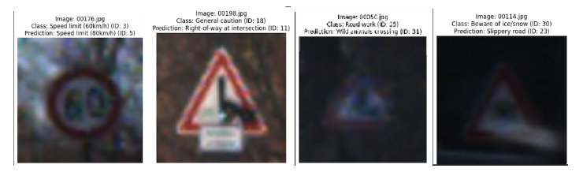

# Convolutional Neural Networks for Sign Recognition in Autonomous Vehicles

## Introduction
In the rapidly evolving field of autonomous driving, the ability to accurately recognize road signs is critical. This project leverages the power of Convolutional Neural Networks (CNNs) to enhance sign recognition capabilities, with a specific focus on the diverse and challenging environments encountered in Germany.

## Project Approach
I have developed several modules to achieve optimal average results. These modules involve building models from scratch, in addition to utilizing transfer learning with modules that have undergone thorough study and research. Multiple models and iterations of each model type were tested to determine the best averages and which model demonstrated the most consistent ability to address the presented problem. Among the experimented models, those utilizing transfer learning included InceptionV3 and VGG-16. One side effect of using previously trained models is that they tend to lack certain desired recognition.

In the case of the aforementioned models, they were primarily trained for face recognition rather than our intended target of signs. Utilizing the existing architecture but training from scratch allows the model to learn how to identify traits specific to signs. The difference after training a model without retraining the InceptionV3 base and after retraining is noticeable, with an over 30% increase in accuracy.

- **Building Custom Models**: Starting from scratch to tailor our models specifically to the nuances of sign recognition.
- **Implementing Transfer Learning**: Utilizing proven architectures like InceptionV3 and VGG-16 to jump-start the training process, despite their initial design for different tasks such as facial recognition.

### Model Training and Iterations
Multiple iterations of each model type were rigorously tested to identify which models delivered the best performance and consistency in recognizing street signs.

### Challenges Addressed
- **Recognition in Diverse Conditions**: Including low-light environments and obstructed views caused by graffiti.
- **Data Augmentation**: Employed techniques such as stretching, shrinking, zooming, shearing, and flipping to enhance model robustness.

## Data Augmentation Techniques
To counter specific challenges such as dim lighting and obscured signs, we implemented the following augmentation strategies:
- **Brightness Adjustment**: Randomly altered the brightness during training to simulate varying lighting conditions, significantly reducing misclassification of dark images.
- **Synthetic Graffiti**: Developed an algorithm to add random synthetic lines on signs during training to mimic graffiti.

## Pre-Processing Enhancements
- **Grayscale Conversion**: Simplified the input data to focus on structure rather than color, which improved consistency across varied lighting and weather conditions.
- **Image Blurring**: Intentionally blurred some training images to prepare the model for real-world scenarios where camera focus might vary.

## Model Analysis
- **F1 Score Achievement**: The best-performing model achieved an impressive F1 score of 98%.
- **Error Analysis**: Continued challenges include handling images with poor lighting and obscured details.

## Confidence in Practical Application
- **Dashcam Variability**: Recognized the need to handle multiple captures of the same sign with slight variations, emphasizing the model's ability to discern crucial details despite visual impairments.
- **Dataset Optimization**: Suggested improvements for the dataset include more diverse representations of signs under various conditions to ensure comprehensive learning and reliability.

## Future Directions
- **Enhancing Dataset Diversity**: Plans to incorporate a broader array of images, covering more classes of signs and conditions.
- **Balancing Dataset Distribution**: Addressing the underrepresentation of less common signs to avoid potential misrecognitions in less frequent, yet critical scenarios.

## Conclusion
This project has laid a strong foundation for the development of highly accurate and reliable sign recognition systems for autonomous vehicles. By continuously refining our models and datasets, we aim to achieve unprecedented levels of safety and performance in autonomous navigation technologies.

