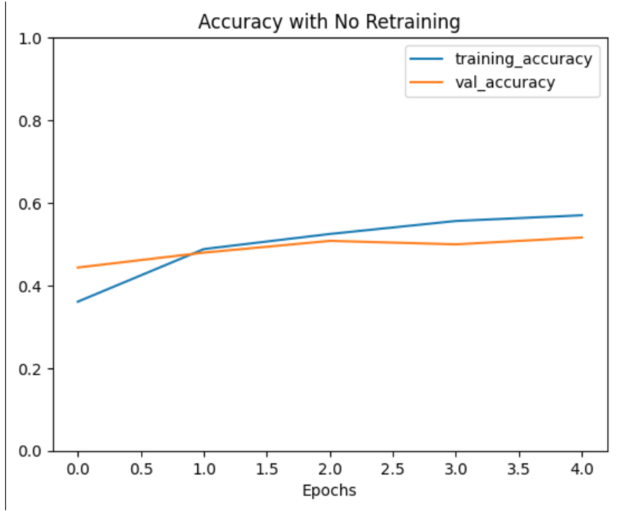
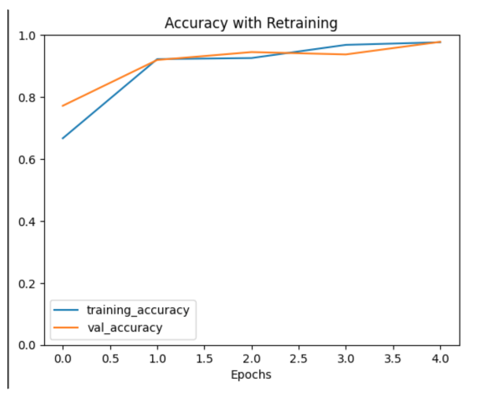
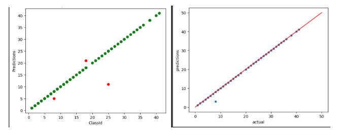
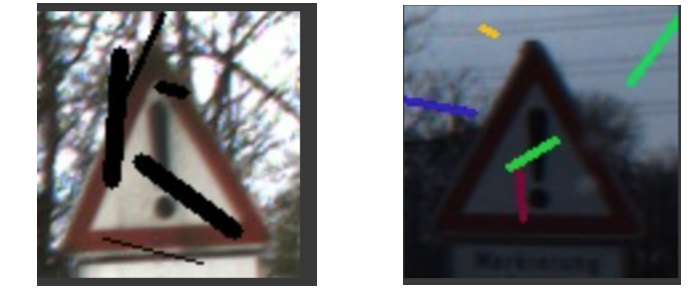
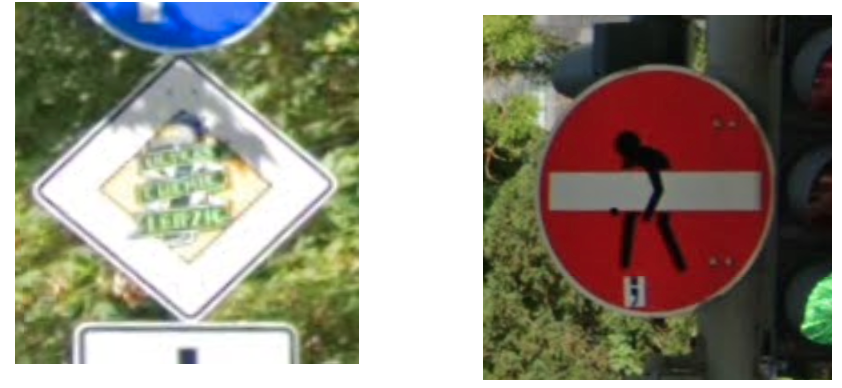
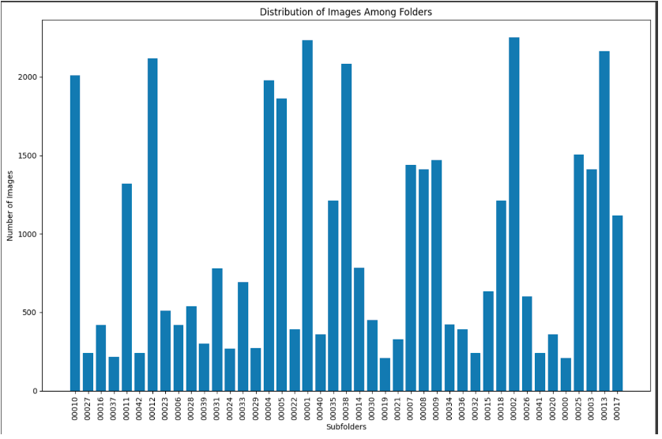

# Advanced Sign Recognition for Autonomous Vehicles Using CNN

## Introduction
In the rapidly advancing domain of autonomous driving, the ability to accurately recognize street signs is paramount. This project leverages Convolutional Neural Networks (CNNs) to enhance sign recognition capabilities. The focus is on robust and accurate sign recognition in Germany, positioning GehirnWagen as a frontrunner in the autonomous vehicle industry.

## Approach
This approach integrates custom-built models and transfer learning techniques to optimize performance and accuracy. Key aspects include:

- **Model Development**: Starting from scratch to specifically tailor this CNNs for sign recognition.
- **Transfer Learning**: Utilizing pre-trained models such as InceptionV3 and VGG-16, which are adapted to this specific needs despite their initial focus on different recognition tasks.

### Transfer Learning Challenges
Originally trained for facial recognition, these models required significant retraining to shift their focus to street signs. This adaptation has led to an over 30% increase in recognition accuracy after fine-tuning the models for this specific use case.

## Iterative Model Improvement
Post-training, extensive testing was conducted to refine the model's accuracy further:

- **Test Data Evaluation**: Analyzing the model's predictions to identify and correct misclassifications.
- **Continuous Learning**: Adjusting model parameters based on testing feedback to improve recognition accuracy.

### Addressing Recognition Challenges
Key challenges addressed include low-light conditions and obstructed views, such as signs covered in graffiti or obscured by environmental factors.

## Data Augmentation Techniques
To enhance the model's ability to generalize from the training data, we employed various data augmentation techniques:

- **Geometric Transformations**: Including stretching, shrinking, zooming, shearing, and horizontal flipping.
- **Photometric Transformations**: Adjusting brightness to simulate different times of the day and varying weather conditions.

## Pre-Processing Enhancements
Pre-processing steps were crucial for preparing the data for optimal model performance:

- **Grayscale Conversion**: Simplifying color images to grayscale to reduce computational complexity and focus on structural details.
- **Image Blurring**: Intentionally introducing blur to train the model to handle real-world imperfections in image quality.

## Comprehensive Analysis
The refined models achieved an F1 score of 98%, demonstrating high precision and reliability. The remaining challenges primarily involve handling images with poor lighting and visibility.

## Practical Considerations and Future Work
Real-world deployment requires the model to handle variably captured images from dashcams, which often include multiple shots of the same sign under slightly different conditions.

### Dataset Optimization
Further improvements will focus on diversifying the training dataset to cover a broader range of scenarios, including different weather conditions, sign obstructions, and varying light conditions.

## Conclusion
This project sets a new benchmark in sign recognition for autonomous vehicles, combining innovative CNN techniques with rigorous testing and data augmentation to build a highly reliable recognition system. This ongoing efforts will continue to push the boundaries of what is possible in autonomous vehicle technology.

---
